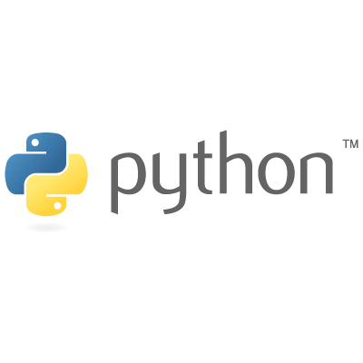

<p align="center">
  <a href="" rel="noopener">
 </a>
</p>

<h2 align="center">Python Projects</h2>

<div align="center">


[](https://github.com/mahimai-raja/open-source-python-projects-2023)
[](#contributors-)


</div>

---

[](https://github.com/piyushsuthar/github-readme-quotes)

[](https://forthebadge.com)
[](https://forthebadge.com)

## 💎 Vision of Repository <a name = "about"></a>

This repository is created as open source library where peole can come and enrich their knowledge by sharing.

## Contributing 🤝

Contributions, issues and feature requests are welcome!

Feel free to check [issues page](https://github.com/mahimai-raja/open-source-python-projects-2023/issues).

## Steps To Follow

- Select an issue and ask to be _assigned_ to it.
- Check existing scripts in the [projects](/projects/) directory.
- **Star** this repository.
- On the [open-source-python-projects-2023](https://github.com/mahimai-raja/open-source-python-projects-2023) repo page, click the **Fork** button.
- **Clone** your forked repository to your local machine. 

- Checkout to development branch (*name your branch according to the issue name*).

    ```bash
    git checkout -b <branch-name>
    ```

- Create a folder in
  [projects directory](https://github.com/mahimai-raja/open-source-python-projects-2023/tree/main/projects)
  according to issue name.
- Write your code and add to the respective folder in the projects directory, locally.
- Don't forget to add a `README.md` in your folder, according to the
   [README_TEMPLATE.](https://github.com/mahimai-raja/open-source-python-projects-2023/tree/main/README_TEMPLATE.md)

- Add the changes with `git add`, `git commit` ([write a good commit message](https://chris.beams.io/posts/git-commit/), if possible):

    ```bash
    git add -A
    git commit -m "<your message>"
    ```

- Push the code _to your repository_.

    ```bash
    git push origin <branch-name>
    ```

- Go to the GitHub page of _your fork_, and **make a pull request**:

## README Template for scripts

[README Template](https://github.com/mahimai-raja/open-source-python-projects-2023/tree/main/README_TEMPLATE.md)

## Contributors ✨

SR No   | Project | Author  
--- | --- | ---
01 | [Live Graph](https://github.com/mahimai-raja/open-source-python-projects-2023/projects/live-graph) | [iKurious](https://github.com/mahimai-raja)
02 |[Twitter Bot](https://github.com/mahimai-raja/open-source-python-projects-2023/projects/twitter-bot) | [Abylin Johnson](https://github.com/abylinjohnson)
03 | [Live Graph](https://github.com/mahimai-raja/open-source-python-projects-2023/projects/ml-api) | [iKurious](https://github.com/mahimai-raja)