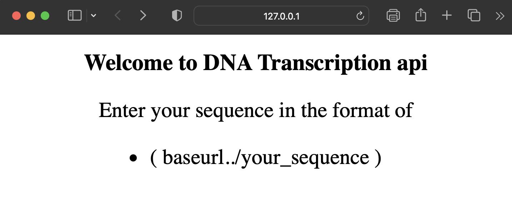
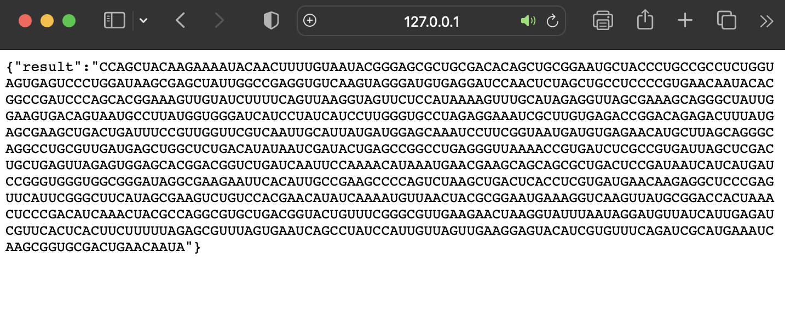

# DNA Transcription Api

A lite weight web-based api that transcribes the given DNA into  mRNA and gives outputs in JSON.

### Prerequisites

```bash
pip install -r requirements.txt
```


### How to run the script

#### >> Host the api :
```python
python -m flask run
```

## Sample Result :

### Home page :

<br><hr>

### API Result :

<br><hr>


## *Author Name*


### [Mahimai Raja J (iKurious)](https://mahimairaja.in)