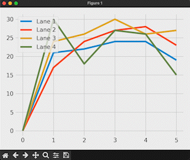

# Live Graph
I have made a live plotting of live plot from a stream of data appending in a csv using matplolib.

### Prerequisites

```bash
pip install -r requirements
```

### How to run the script

```bash
python datagen.py
python liveplot.py
```

### Sample Output :
<!--Remove the below lines and add yours -->



## TODO :
- To set limit for x axis so that it looks dynamic on more datapoints.


## *Author Name*

### [Mahimai Raja J (iKurious)](https://mahimairaja.in)