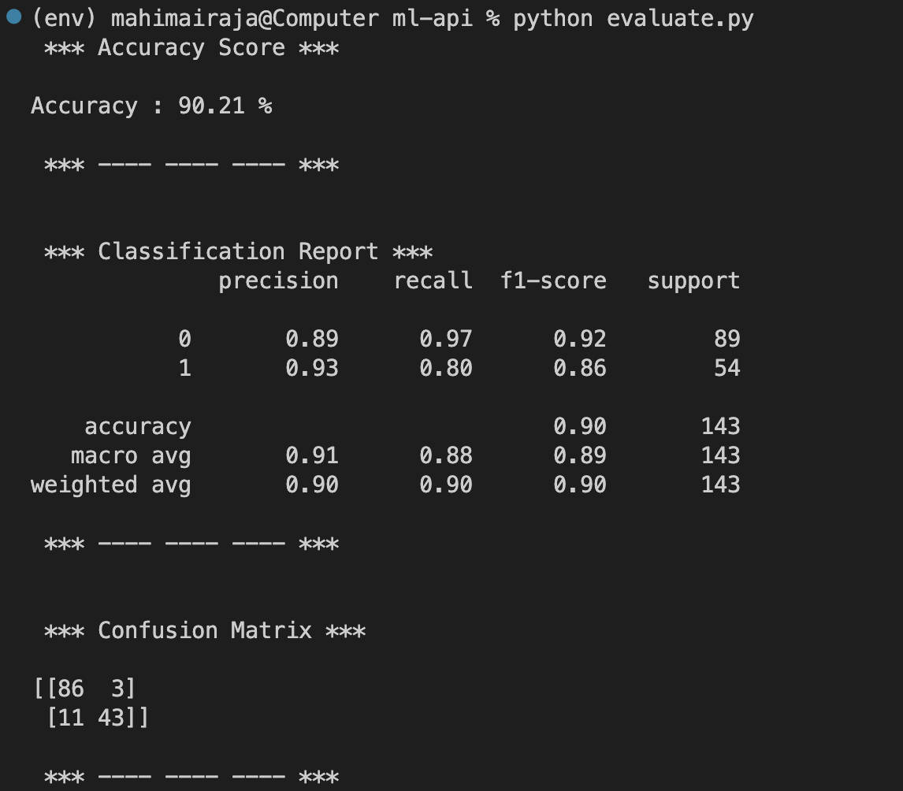
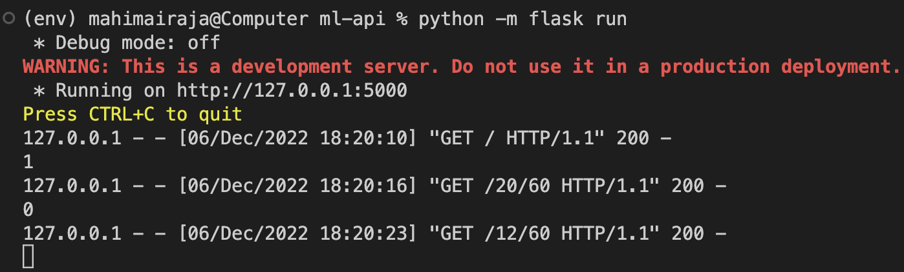
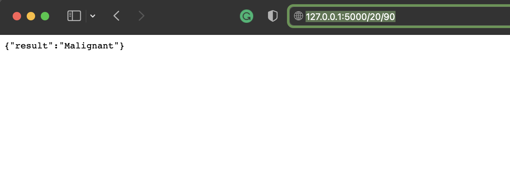

# Machine Learning API

A lite weight machine learning web prediction with flask api that gives outputs in JSON.

### Prerequisites

- Install swig3
- Install xgboost
- Install gcc
```bash
pip install -r requirements.txt
```


### How to run the script

#### 1) Train the model :
```python
python train_model.py
```
#### 2) Evaluate the model :
```python
python evaluate.py
```
#### 2) Host the api :
```python
python -m flask run
```

## Sample Result :

### Model Evaluation :

<br><hr>

### Web Hosting API :

<br><hr>

### API Prediction 01:

<br><hr>

### API Prediction 02:

<br><hr>


## *Author Name*


### [Mahimai Raja J (iKurious)](https://mahimairaja.in)