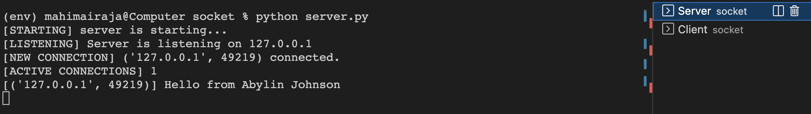
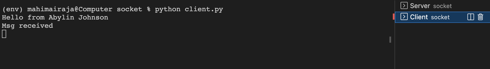

# Socket Programming
<!--Remove the below lines and add yours -->
Socket programming can be implemented to communicated between two computing resources throuhg http.

### Prerequisites
<!--Remove the below lines and add yours -->
- In most cases sockets come along your python module.

else  : 
```bash
pip install -r requirements.txt
```

### How to run the script
<!--Remove the below lines and add yours -->
- First start your server in a terminal.
```bash
python server.py
```
- Then make request with your client in a terminal.
```bash
python client.py
```


### Sample Outputs :
#### Server :


#### Client :


## *Author Name*
### [Abylin Johnson](https://github.com/abylinjohnson)